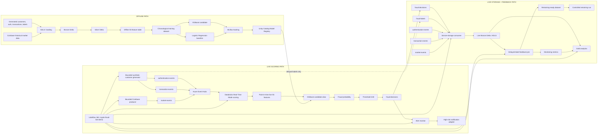

# Architecture

This project implements an end-to-end crypto fraud detection platform with separate offline training, live scoring, live durable storage, feedback, retraining, and Gold monitoring paths.

## Architecture Diagram

## One-Click Demo Orchestration

The `crypto-fraud-live-demo` Lakeflow Job is the portfolio demo entry point. A manual `Run Now` starts managed job compute with `spark.databricks.streaming.realTimeMode.enabled=true`, runs bounded producers, runs Real-Time scoring against `crypto_fraud.models.fraud_detection_model@candidate`, monitors `fraud-decisions` for alertable model decisions, persists live Event Hubs data to Bronze, refreshes feedback without retraining, refreshes Gold analytics, and finishes with a final summary task.

The alert path is event-driven from `fraud-decisions`. Alerts require `predicted_fraud = true` and `fraud_probability >= 0.80`; delayed `fraud-labels` are not used to create prediction alerts. A separate test-alert mechanism validates the external webhook channel without inserting a test event into `fraud-decisions` or affecting Bronze, Gold, or model metrics.

The demo uses bounded components and preserves existing checkpoints. Bronze storage uses the `bronze-storage` consumer group and existing Delta tables. Feedback refresh runs with retraining disabled for ordinary demos; controlled retraining remains a separate workflow.

## Key Boundaries

- Fraud labels are never used by the live scoring feature pipeline.
- Fraud labels enter only after scoring, through feedback, monitoring, and retraining workflows.
- Event Hubs are transport and buffering; Delta tables in Unity Catalog provide durable storage.
- The live scoring consumer group is `stream-processing`.
- The durable Bronze storage consumer group is `bronze-storage`.
- Phase 16 registered retrained model version `2`, but the active live model remains `crypto_fraud.models.fraud_detection_model@candidate`.
- Threshold `0.80` is preserved in scoring, feedback, Gold analytics, and dashboard SQL.

## Data Layers

- Landing: generated historical files and collected source inputs.
- Bronze: durable raw or near-raw records with ingestion and Kafka/Event Hubs metadata.
- Silver: cleaned, typed, deduplicated entities and events.
- Features: point-in-time offline features, training datasets, and retraining-ready feedback datasets.
- Monitoring: delayed-label feedback tables and model outcome metrics.
- Gold: business-friendly transaction decisions, KPI summary, activity time series, and model monitoring summaries.

## Final Gold Outputs

- `crypto_fraud.gold.fraud_transaction_decisions`
- `crypto_fraud.gold.fraud_kpi_summary`
- `crypto_fraud.gold.fraud_activity_timeseries`
- `crypto_fraud.gold.model_monitoring_summary`

Dashboard-ready SQL is available in `sql/fraud_monitoring_dashboard.sql`.
